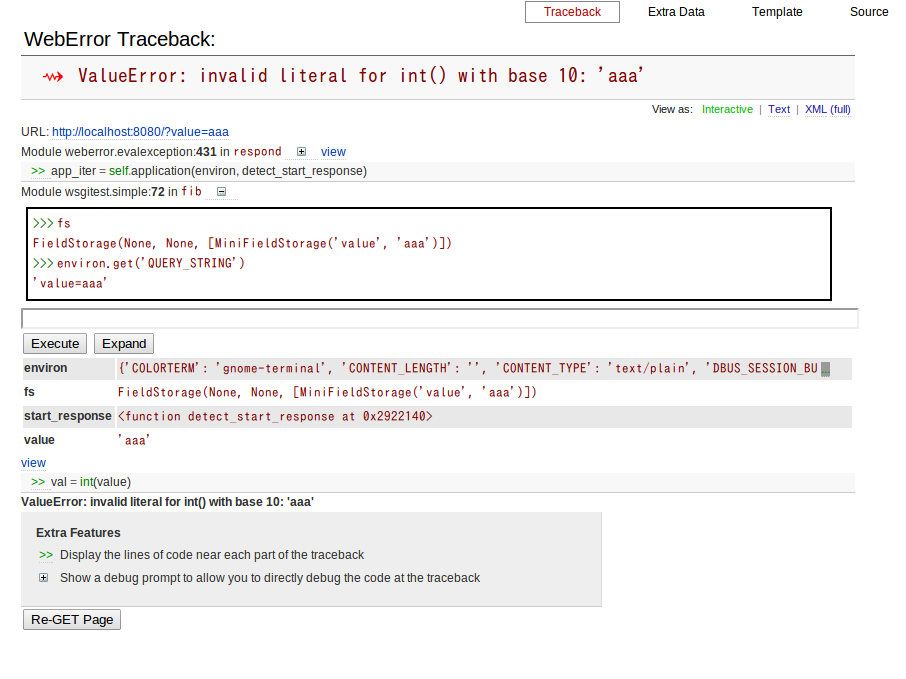

=======================================
 WSGI でなんかつくってみる #python_adv
=======================================

`2012 Pythonアドベントカレンダー(Webフレームワーク) <http://connpass.com/event/1439/>`_ の二日目です。

なんかすごーく長くなりました。

WSGI だけでなんか作る内容…のはず。

WSGI とは
=========

WSGI とは Web Server Gateway Interface の略で `PEP333 <http://www.python.org/dev/peps/pep-0333/>`_ ( `日本語訳 <http://knzm.readthedocs.org/en/latest/pep-0333-ja.html>`_ ) で定義されているものです。

Python3 においては `PEP3333 <http://www.python.org/dev/peps/pep-3333/>`_ があります。
文字列周りの定義が変わった以外は PEP333 と変わらないのでまあ適当に。

PEP3333 は去年の `Advent Calendar <http://d.hatena.ne.jp/shomah4a/20111225/1324813404>`_ でなんか書いた気がするのでそれはそれで。

`PEP444 <http://www.python.org/dev/peps/pep-0444/>`_ なんてのもありましたが、本当にそんなのもありましたねーで終わりそうなのでスルーしてあげるのが大人の優しさです。

WSGI について詳しいことは `gihyo.jp <http://gihyo.jp/dev/feature/01/wsgi>`_ に書いた記事を見てくださいめんどくさいので。

とりあえず WSGI については世にある様々な Web アプリケーションフレームワークが WSGI に対応しているということと、 WSGI サーバと WSGI アプリケーションと WSGI ミドルウェアについてわかっていれば大丈夫です。頑張ってください。

で、今年は去年と同じ事をしても仕方がないのでなんか作ってみることにします。

Web アプリケーションフレームワークなんか使わなくてもなにかしら作れるんだぜみたいなことがわかるといいかもね。

Hello, World
============

WSGI で Hello, World します。

WSGI のアプリは大体以下のような定義っぽいです。

- environ, start_response という引数を受け取る

  - environ は環境変数の辞書
  - start_response は callable なオブジェクト

- 処理の中で start_response にレスポンスコードとレスポンスヘッダを渡して呼び出す
- 返り値は iterate すると文字列を取り出せる iterable オブジェクト

返した iterable を iterate して取得した文字列はレスポンスボディとして使われます。

Hello, World するアプリは以下のような感じです。

.. code-block:: python

   def hello(environ, start_response):
       u'''
       Hello, world を返す
       '''

       # ステータスコードとコンテントタイプだけ返す
       start_response('200 OK', [('Content-Type', 'text/plain')])

       # 本文
       return ['Hello, World']

で、作ったので動かしましょう。

動かすには wsgiref.simple_server というモジュールが標準ライブラリにあるのでこれを使います。

.. code-block:: python

   def run(app):
       server = simple_server.make_server('', 8080, app)
       server.serve_forever()

   if __name__ == '__main__':
       run(hello)

で、これを動かしたらブラウザで http://localhost:8080/ にでもアクセスすると "Hello, World" と挨拶を返してくれることでしょう。

動きましたね? 動きましたよね?

では次行きます。

パラメータを受け取ってみる
==========================

Hello, World が動いたら次はなんかパラメータを受け取って処理します。

パラメータは `environ['QUERY_STRING']` に URL の ? 以降のクエリ文字列が入っています。

POST やその他のメソッドで渡されるリクエストボディは `environ['wsgi.input']` に file-like オブジェクトがあるのでそれから読みましょう。

と書いておいてなんですが、ぶっちゃけ文字列とかファイルっぽいオブジェクトを渡されてもめんどいので標準モジュールにある `cgi.FieldStorage <http://docs.python.jp/2/library/cgi.html>`_ を使います。

以下のように書くとクエリ文字列か application/x-www-form-urlencoded なリクエストボディにある `'param'` というパラメータの値を撮ってきて返します。

パラメータがないときは `'default value'` を返します。

多分リクエストボディがないときに `fp` を渡すとよくなかったと思うのでなんか対策したほうがいいかもしれないっすね。

.. code-block:: python

   fs = cgi.FieldStorage(environ=environ, fp=environ['wsgi.input'])
   value = fs.getfirst('param', 'default value')

これを使ってなんとなく書いてみたのが以下のフィボナッチ数を計算して返す WSGI アプリケーションです。

.. code-block:: python

   def calc_fib(value):
       u'''
       フィボナッチを計算する
       '''

       x, y = 0, 1

       for x in xrange(value):
           x, y = y, x + y

       return x

   def fib(environ, start_response):
       u'''
       フィボナッチを計算して返す WSGI アプリケーション
       '''

       fs = cgi.FieldStorage(environ=environ, fp=environ['wsgi.input'])

       # value というパラメータを取ってくる
       value = fs.getfirst('value', '0')

       val = int(value)

       result = calc_fib(val)

       start_response('200 OK', [('Content-Type', 'text/plain')])

       return [str(result)]

で、先ほどの `run` 関数に `fib` を渡してサーバを立ち上げ、 http://localhost:8080/ にアクセスすると `0` と表示されます。

このアプリケーション内では value というパラメータを見ているので http://localhost:8080/?value=10 としてパラメータを渡すと `37` と表示されるはずです。

ほら、パラメータを受け取ってそれに応じて処理するなにかができましたね。

数字以外を渡すとエラーになるのでまあなんとかしてあげてください。

.. note::

   今は多分 500 Internal Server Error が返っていると思うので、 param の値が変だったら 400 Bad Request でエラーを返すように変えてみましょう。

URL マッピングしてみる
======================

さて、今までは普通のアプリを動かしていただけですが、ここで複数のアプリを動かしたいなーとか思ったとしましょう。

思いましたか? 思いましたね? 思ってくれないと先に進まないので思っておいてください。

そういう時は WSGI のミドルウェアを使います。

ミドルウェアとは

- サーバ側から見ると environ, start_response を受け取るアプリケーションとして振る舞う
- アプリケーション側から見ると environ, start_response を渡して呼び出すサーバとして振る舞う

というものです。

試しに何もしないミドルウェアを作ってみます。

.. code-block:: python

   def empty(app):
       u'''
       何もしないミドルウェア
       '''

       def internal(environ, start_response):

           return app(environ, start_response)

       return internal

ただ受け取った関数に引数をそのまま渡すだけの高階関数です。

これを使って fib をラップするには

.. code-block:: python

   app = empty(fib)

とします。

この app は WSGI アプリケーションとして振舞うので `run` 関数に渡せばそのまま動きます。

が、何も変わりません。

何もしないミドルウェアなので当然です。

で、ミドルウェアとしては例えば URL マッピングを行うものがあるでしょう。

.. code-block:: python

   def url_mapping(environ, start_response):
       u'''
       url マッピングをしてみよう
       '''

       # 呼び出された時のパス (mod_wsgi とか使うときに必要)
       script_path = environ['SCRIPT_NAME']

       # このスクリプトに渡されたパス情報
       path = environ['PATH_INFO']

       if path == '/fib':
           # フィボナッチを計算する
           return fib(environ, start_response)
       else:
           # hello, world
           return hello(environ, start_reponse)

まあ大体こんな感じです。

これは高階関数として定義していないのでそのままアプケーションとして振る舞います。

ソースを見ればわかりますが、 /fib にアクセスされるとフィボナッチを、それ以外では Hello World を返すようなアプリケーションです。

でもこれだと汎用性がないので汎用性をもたせましょう。

.. code-block:: python

   def mapping(patterns, default=None):
       u'''
       patterns に登録してあるマッピング情報絵振り分ける

       :param dist patterns: パスをキー、 WSGI アプリケーションを値とする辞書
       :param app default: パスにないときに呼ぶアプリケーション
       '''

       def internal(environ, start_response):

           path = environ['PATH_INFO']

           if path in patterns:
               return patterns[path](environ, start_response)
           elif default is not None:
               return default(environ, start_response)

           start_response('404 NotFound', [('Content-Type', 'text/plain')])

           return ['{0} not found'.format(path)]

       return internal

こんな感じでマッピング用にキーとアプリケーションの辞書を受け取ってアプリケーションを返します。

これを

.. code-block:: python

   app = mapping({'/fib':fib}, hello)
   run(app)

とやると、大体さっきのマッピングアプリケーションと同じように動きます。

まあお試しください。

ミドルウェアを使うと、アプリケーションとは独立して機能を追加したりできます。

認証やらキャッシュやらするようなミドルウェアも世にはあるので色々試してみるといいでしょう。

.. note::

   余力のあるひとはアプリケーションで例外が発生した時に、それをキャッチしてトレースバックをレスポンスとして返すようなミドルウェアを作ってみると面白いかもしれません。

   既にどこかに転がっているとは思いますけどね :)

ライブラリを使ってみる
======================

以上のようにマッピングとかかけますが、めんどくさいです。

そういう時はライブラリを使いましょう。

- `paste <http://pythonpaste.org/>`_
- `werkzeug <http://werkzeug.pocoo.org/>`_ (ゔぇるくつぉいくとか発音するらしい)

とかまあ色々あります。

URL マッピング
--------------

paste でも werkzeug でもいいのですが URL マッパーを使ってみます。

werkzewg を使ってみようかと一瞬思いましたが、 `結構面倒 <http://werkzeug.pocoo.org/docs/routing/>`_ そうなのでここは paste で。

.. note::

   でも paste は最近更新されていないし機能も貧弱なので werkzeug 使ったほうがいいと思います。

使い方は簡単です。

.. code-block:: python

   from paste import urlmap

   def map():

       # デフォルトのアプリケーションを渡す
       mapping = urlmap.URLMap(hello)

       # /fib に来たらフィボナッチな感じ
       mapping['/fib'] = fib

       # 起動!
       run(mapping)

まあソース見れば自明でしょうが、この状態で http://localhost:8080/fib にアクセスすると先ほどのフィボナッチを、それ以外にアクセスすると hello, world を返します。

とってもわかりやすく簡潔に書けるようになりましたね!

paste でも werkzeug でも URL マッパーがあるので上記のようなしょぼいものを使わないでまともなものを使いましょう。

それ以外
--------

さて、 URL マッパーはあんなもので、それ以外の例として weberror でも使ってみましょう。

weberror はその名の通りエラーハンドリングするためのミドルウェアが色々入っています。

例えば evalexception はエラー時のコンテキストを使って色々と評価できるので色々便利です。

以下のようのに fib を包んであげるだけです。

.. code-block:: python

   from weberror import evalexception

   def main():

       run(evalexception.EvalException(fib))

この状態でエラーが出るように数字以外の文字列を渡してみると

   weberror の画像

ほら、こんな感じにエラーが出たスタックの状態で色々試せるんですよ。便利でしょ。

多分 Web アプリケーションフレームワークには普通に備わってそうだけどね!

裏側で状態を持っているのでマルチスレッドなサーバでは使えなかったりするけどデバッグ用にはかなーり便利ですね。

他にも
------

ここで紹介した paste や werkzeug などの他にも WSGI のミドルウェアはたくさんあります。あると思います(よくしらない)。

気になる方は `PyPI <http://pypi.python.org/pypi>`_ で `wsgi` とかそんなので検索するととってもいいのではないでしょうか。

まとめ
======

以上のようにフレームワークを使わなくてもなんとなくアプリケーションが作れるんだぜって話でした多分。

まあここの話はコントローラあたりの話でしかないので model とか view には `SQLAlchemy <http://pythonpaste.org/>`_ とか `Zope Page Template <http://pypi.python.org/pypi/zope.pagetemplate>`_ とか使いましょうね。

あとさすがに生で wsgi 使うの辛いわーって人は `WebOb <http://webob.org/>`_ とか使うと幸せになれるかもしれないよ。

何がしたいのかよくわからない記事でしたがなんかの参考になれば。
